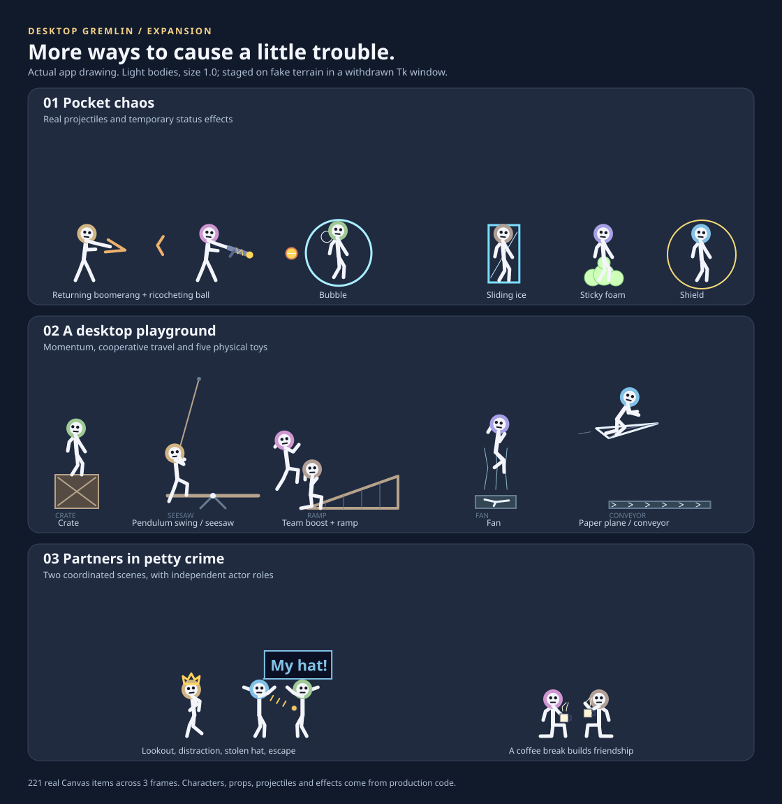

# Desktop Gremlin expansion

Seven new weapons, persistent relationships, group activities, physical toys,
new ways to travel, and a configurable cast run through the normal app.



The preview uses light bodies at size 1.0. Its characters, projectiles, effects,
poses and props come from production drawing code, staged on fake terrain.

**Start and choose the cast**

Open `DesktopGremlin.exe` from the extracted Windows download (source developers
can use `run_gremlin.bat`). Right-click a gremlin, or choose **Settings** from
the tray icon. Press **Apply** after editing settings.

- **Behaviour:** choose a play mode and enable **Friendships and group scenes**,
  **Parkour, swings and paper planes**, and **Build temporary playground toys**.
  These three features default to on; the default mode is Mischief.
- **Cast:** leave **Automatic cast** checked to use **How many of them** in
  Behaviour. Turn it off to select any combination of the ten characters.
  At least one character stays selected; each identity appears once.
- Choose a character in Cast to set a nickname, halo colour (`#RRGGBB`) and hat.
  Hats are none, cap, beanie, crown, tophat and bow. Changing appearance or a
  nickname keeps that character's history.
- To choose weapons, turn off **Use this character's default weapons** and
  check the allowed list. An empty list means that character does not fight.
  Turn default weapons back on to restore its usual selection.

For a broad first look, choose five or six characters, Mischief, and all three
feature switches. Leave them free to wander for a minute or two. Scenes depend
on available actors, nearby partners and terrain; they are chosen automatically.
There is no per-scene launch menu. A larger cast makes the three-person scenes
possible. **Bring them to my cursor** in the tray menu can gather a scattered
cast before the next activity.

| Mode | What happens |
|---|---|
| Peaceful | Quiet games, coffee, naps, rescues, movement and toys. Combat and hostile scenes are suppressed. |
| Mischief | A mixture of combat, pranks and shared activities. |
| Battle | More combat and less frequent ambient scene selection; movement, rescues and activities remain available. |

Changing mode cancels active expansion actions and clears ammunition/traps so
an earlier fight cannot spill into Peaceful mode. Cast controls, movement and
toy switches work independently.

**The seven weapons**

The Cast weapon list uses the short names in the first column. To see one more
often, give a character only that weapon and use Mischief or Battle with at
least two characters.

| Weapon | Visible behavior | Default users |
|---|---|---|
| Boomerang | Flies out, returns and can be caught. An awkward return can bonk its owner. | Showoff, Veteran |
| Bubble | Encloses a victim in a floating bubble; a hit can pop it. | Coward, Drama |
| Freeze | Makes a sliding ice cube that rebounds from boundaries and can bump another gremlin. | Sniper |
| Swap | Exchanges the shooter's and victim's positions. | Magpie, Tinkerer |
| Glove | Launches a boxing glove and kicks the shooter backward. | Brawler, Zealot |
| Rubber | Bounces a rubber ball off surfaces and gremlins, with a finite bounce limit. | Tinkerer |
| Foam | Sticks the victim in foam; a nearby friend can work it loose. | Grump |

Bubble, ice and foam expire. A friend can break these bindings with a hit
without dealing that hit's damage. Successful rescues and getting up after a
knockout grant a brief golden shield: three seconds or 20 absorbed damage,
whichever runs out first. A rescue preserves an existing shield.

**Friends, rivals and things to watch for**

Shared activities and rescues improve relationships; hits and betrayals create
grudges. Relationships influence opponent choice. Pair scores persist between
runs under stable character identities, even when nicknames change or a
character temporarily leaves the cast.

| Activity | What makes it observable |
|---|---|
| Alliance | Two characters meet, wear matching green bands and focus on their common strongest target. Friendly fire breaks the pact. |
| Rescue | A friend approaches with a rope, hauls in a falling, dangling, knocked-out or bound partner, and helps them recover. Nearby friends are checked promptly between ordinary scene selections. |
| Hat heist | A lookout distracts the owner while the thief takes the hat and runs. A bare-headed cast can borrow a temporary stage hat. Saved hats return when the scene ends or is interrupted. |
| False surrender | A white flag conceals a dropped spring trap; the rival approaches while the prankster retreats, then gets stuck in foam. |
| Spectators | An uninvolved character watches a live fight and raises a scorecard responding to actual impacts. |
| Grudge court | Rivals take their places at benches, a judge uses a gavel, and a coin of restitution accompanies a softer grudge. |
| Cards | Players sit around a table and deal moving cards. |
| Football | Players shuffle and kick a passing ball between goals. |
| Juggling | A performer tosses three coloured balls; company can cheer. |
| Blanket nap | A blanket and pillow accompany a breathing sleep pose. |
| Coffee | Characters lift cups, sip and watch steam rise. |
| Window inspectors | Resizing an existing window can bring inspectors with a measuring tape and a temporary approval sticker. |

Alliances, heists, courts and spectators need at least three characters. Cards
and football need two. Juggling, coffee and blanket naps also work with a solo
cast. Quiet activities reduce boredom and help build friendships; coffee and
naps restore a little health. To encourage rescues, let characters spend time
together first. Resize a window by more than a small adjustment to give free
characters a reason to inspect it.

**Movement and the playground**

Leave Parkour enabled and keep ordinary windows or icon ledges available.
Characters look for suitable conditions as they travel:

- **Rope swing:** hang from an elevated anchor, swing as a pendulum and carry
  their momentum into the release.
- **Wall kick:** push away from a nearby window edge while airborne.
- **Landing roll:** roll out of a fast moving landing.
- **Vault:** cross a nearby low obstacle.
- **Projectile slide:** duck into a sliding dodge when a shot approaches.
- **Paper plane:** launch from height, glide down and land; hitting a window
  side causes a crash and tumble.
- **Team boost:** a nearby helper crouches and launches a partner upward.

With temporary toys enabled, free grounded characters periodically build a
crate, seesaw, ramp, fan or conveyor. Crates provide landing surfaces, a seesaw
can launch someone on its opposite end, ramps support walking uphill, fans
lift characters, and conveyors carry them sideways. Toys are drawn objects;
they do not create files or move real desktop items.

**Limits, cleanup and memory**

The coordinator runs at most two scenes at once and gives actors a cooldown.
Scenes last roughly four to nine seconds; alliances last up to 18 seconds.
There are at most six toy props, each lasting about 55 seconds, and 32 new
weapon projectiles at a time. Rubber balls stop after a bounded number of
bounces. Status effects expire and are removed when their ownership ends.

Grabbing, damage, sleep, cast removal and hiding interrupt incompatible
activities. Temporary hats, ropes and scene props are cleaned up. Closing a
window removes its inspector props. Native rendering remains disabled; the
app uses Tk. Real icon/window movement still has its existing separate opt-in
controls and backup protections.

**Make them forget everything about me** in Settings clears relationship
memory along with the existing counters and cancels current social scenes.
The relationship graph stores only character pairs and bounded scores; no
window titles, handles or application history are added to it. Appearance
preferences stay in settings.

Use **Pause** or **Quit** from the tray menu as usual. **Ctrl+Alt+Shift+Q** is the
keyboard exit when registration succeeds.

**Verification and preview reproduction**

From the project folder, run:

```powershell
.venv/Scripts/python.exe -B tests/run_all.py
.venv/Scripts/python.exe -B scripts/preview_expansion.py
```

The preview command rewrites `docs/expansion-preview.svg` and prints per-panel
Canvas item counts. It uses the shared test harness, fake desktop readers and
an owned withdrawn Tk window. It does not start a desktop overlay or capture
the user's desktop. The generated SVG was also rasterized and visually checked;
automated scenario checks remain distinct from long-term desktop use.
