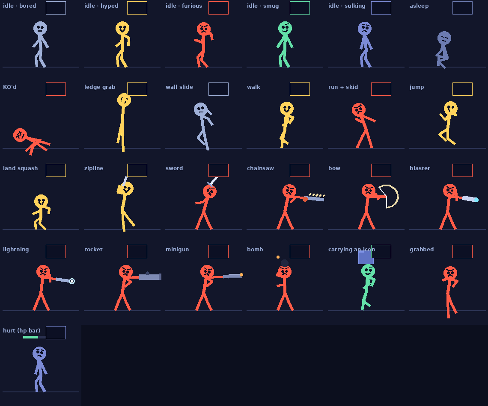

# Desktop Gremlin

One to ten chaotic stick figures who live **on top of** your real Windows
desktop and treat your actual icons and open windows as their personal
playground.

They aren't a wallpaper. A wallpaper sits *behind* your icons and can't see
them. This lot sit above everything and read the real thing — where your icons
are and what they're called, where your windows are, which one you just
clicked, whether you're even at the keyboard.

Then they climb on all of it, and fight each other.



*(That picture predates the black-figure redesign — the poses and weapons
are current, the colours are not.)*

---

## Install

Needs **Windows** and **Python 3.8+** ([python.org](https://www.python.org/downloads/) —
tick *Add python.exe to PATH* during setup).

```
git clone https://github.com/mbwallace1390/desktop-gremlin.git
cd desktop-gremlin
```

Then double-click **`run_gremlin.bat`**. It installs `pywin32` the first time,
launches them with `pythonw`, and closes itself - there is no console window
left behind to keep open. Quit from the tray icon.

Or by hand:

```
pip install -r requirements.txt
python desktop_gremlin.py
```

Everything lives on the **tray icon**, bottom-right: Settings, Pause, Bring
them to my cursor, Restore my icon layout, Quit. Right-clicking a gremlin also
opens Settings.

Running `python desktop_gremlin.py` by hand keeps a console, and closing it
kills them - that console is their parent process. Use `pythonw
desktop_gremlin.py` instead, or just use the .bat.

---

## What they actually read

| Thing | How |
|---|---|
| Desktop icon positions and names | `LVM_GETITEMRECT` / `LVM_GETITEMTEXT` on the shell's `SysListView32` |
| Open windows | `EnumWindows` + `DwmGetWindowAttribute` for the true visual frame |
| Which window you're using | `GetForegroundWindow` |
| Whether you're there | `GetLastInputInfo` |
| Where the floor is | per-monitor work area, so they stand *on* your taskbar |

Rescanned every 1.6 seconds, on a thread of its own so a busy Explorer never
stalls the animation. Icon tops and window title bars become platforms. Drag a
window across the screen and whoever's standing on it rides along.

---

## They can move your actual icons

Off by default. Turn it on in **Settings → *Let them actually drag my desktop
icons***.

With it on, one of them beats up an icon, hoists it over their head, carries it
across the desktop and drops it somewhere else — and your icon is genuinely
there now. Not an animation of an icon. The icon.

Explosions move them too. A bomb or a rocket landing in a cluster shoves every
icon in the blast outward, hardest for whatever was closest; a bullet that
strikes an icon knocks it aside. By default stray fire — shots meant for
another fighter, your cursor, or a window — passes over the desktop rather
than being soaked up by whatever icon stood in the way; turn
`shots_over_icons` off if you want the icons to serve as cover. All of it is
clamped to the visible desktop, and all of it is undone by **Restore my icon
layout**.

**The undo:** your layout is written to `gremlin_icon_backup.json` every time
you launch, so **Tray → Restore my icon layout** puts every icon back where it
was when this run started — not where it was months ago when you first tried
this. The one exception: if the last run moved icons and never put them back
(a crash, or a quit with the desktop still scattered), that older snapshot is
the good one, and it is kept until you restore. The very first layout ever
seen stays in the file as `first`, and the last three launches as `previous`,
for recovery by hand.

Safety rules, in the code:

- If that backup can't be written, icon dragging is **forced off** for the run.
  They never move anything that can't be put back.
- If your desktop has **Auto arrange icons** on, Windows snaps everything back
  instantly. The app detects this and says so on startup.
- Icons are always dropped inside the visible desktop, never off-screen.

Roughly a couple of icons every five minutes at default chaos.

---

## The cast

Ten of them, and you choose how many turn up. They join in a fixed order, so
two is always the same two and their records carry over between runs.

| | who | plays like |
|---|---|---|
| 1 | Brawler | charges, melee, loudest thing on screen |
| 2 | Sniper | keeps his distance, ranged, deadpan |
| 3 | Coward | avoids fights, runs when hurt, apologises |
| 4 | Show-off | taunts constantly, rockets and lightning |
| 5 | Grump | slow, quiet, hits hard, complains |
| 6 | Magpie | ignores the others, steals your icons relentlessly |
| 7 | Zealot | never retreats, rage-driven, ignores damage |
| 8 | Tinkerer | bombs, methodical, patient |
| 9 | Drama | over-reacts to everything, sulks longest |
| 10 | Veteran | economical, few words, efficient |

The figures are all the same black. Each one has its own **halo colour**, its
own temperament — how readily it picks a fight, how much it talks, how fast it
moves, how often it jumps, how likely it is to steal rather than smash, and how
much punishment it takes before breaking off — and its own dialogue, right down
to what it says when you pick it up. No two of them share a line.

It's a free-for-all: everyone goes for whoever is nearest. They chase, strike,
knock each other flying, with a deliberate beat between strikes so a fight is
something you can follow rather than a blur. Take enough hits and you're
knocked out — X eyes, flat on your back — then up again a few seconds later,
furious about it. A health bar appears over whoever's hurt. Tick `blood` in
Settings if you want the cartoon red to match: sprays on hits, stains on the
floor that fade on their own — or get mopped up by a water balloon. Only they
bleed; your icons still just spark.

Set `crowd` to anything from 1 to 10.

## They remember you

Between runs, in `gremlin_memory.json`. Each character keeps its own count of
how often you've grabbed it, how often you've thrown it, its win-loss record
against the others, and how many icons it has made off with. A few seconds
after launch one of them will bring it up — *"you've thrown me 41 times"*,
*"{wins} and {losses}, I'm rounding up"* — and a losing streak makes that one
come back keener, with a different line for it.

They also develop a grudge against whichever icon they have picked on most, and
greet it by name.

**Counters, never a log.** Nothing about which applications or windows you use
is written to disk. The only names stored are desktop icon labels, which
`gremlin_icon_backup.json` already holds. **Settings → Make them forget
everything about me** wipes it, and so does deleting the file.

## They notice what you're doing

In memory only, never written down. Twelve window switches in a minute, fifteen
minutes staring at one thing, three hours at the desk, the small hours, an
unsaved-changes marker in a title bar:

> *pick ONE* · *blink. please blink.* · *go to BED* · *SAVE IT*

Each remark has its own five-to-thirty-minute cooldown on top of a global
two-minute one, and nothing fires in the first 45 seconds. The difference
between a desktop pet you keep and one you uninstall is how often it decides to
be clever at you.

Turn the lot off with **react_to_windows**.

## Moods

**bored → hyped → furious → smug → sulking**, and asleep.

The figures themselves are black. Mood is the **halo round the head** — amber
when hyped, red when furious, dim when asleep — plus posture and the face, which
is drawn light so you can actually read it. Every mood has its own eyes and
mouth: furious brows, a hyped grin, a smug smirk, X eyes when knocked out.

The halo tells you who as well as how they feel: each character shifts its own
base colour through the moods, so the Brawler's furious is not the Sniper's.

Left alone too long, boredom curdles into a rampage. They also flare up for no
reason. Once you've been away five minutes they curl up and sleep.

## Loadout

Sword, chainsaw, a giant fish and a frying pan up close — the pan can bat an
incoming round straight back at whoever fired it. Bow, laser blaster, minigun,
rocket launcher and a lightning gun at range. Bombs when they're feeling
expressive, and a blackhole grenade that pulls everything *inward* instead.
A harpoon that reels the other one in, a magnet that drags your icons over. An
anvil and a piano delivered from the sky onto a marked spot. A banana peel and
a springboard placed on the ground and sprung by whoever steps there — owner
included. And for the soft-hearted: a confetti cannon whose ammunition is a
mood (the victim comes out *delighted*), and water balloons that put a fight
out on the spot.

## Getting around

The grapple gun is no longer the only way to travel, and not everything they
do is a fight — a bored gremlin is as likely to take a joyride or wander over
to bother a colleague. Depending on who: a pogo stick, a skateboard, a balloon
ride (poppable, and the sniper knows it), a teleport blink, a self-launching
cannon, a jetpack that wobbles its way to a cruising height and then runs out
of tank, riding on another one's shoulders, or surfing across the desktop
standing on one of your actual icons — that last one obeys the same
`move_icons` switch as dragging, and never happens without the layout backup.
The nervous ones deploy a parachute on long falls. The grump rides nothing.

## Playing with them

Move your cursor near one — two rings appear and a name tag says which one
you're about to grab. Click, drag, throw. They tumble, land, and hold a
grudge. They notice your cursor from
anywhere on screen and sometimes come pick a fight with it.

Everywhere else the overlay is click-through, so it never intercepts your work.

They can leave the screen, and come back on the other side of it. Walk off the
right edge, reappear on the left. It happens when one gets knocked out of view,
and it stops a fight drifting off the edge and carrying on where you cannot see
it — anyone out of sight for more than a moment is brought back round.

---

## Files it writes

All of them sit next to the script, and every one is safe to delete.

| File | What |
|---|---|
| `gremlin_settings.json` | your settings; delete for defaults |
| `gremlin_icon_backup.json` | your icon layout as it was when this run started — the undo |
| `gremlin_memory.json` | what they remember about you |
| `gremlin.ico` | the tray icon, rebuilt each launch |
| `gremlin_log.txt` | only written when there is no console; see below |

## Settings

`gremlin_settings.json`, written by the Settings window. Delete it for defaults.

| Key | Default | |
|---|---|---|
| `scale` | `0.68` | 0.68 = the height of a desktop icon |
| `fps` | `40` | |
| `chaos` | `1.0` | how fast they escalate; scales icon-stealing too |
| `crowd` | `2` | how many of them, 1 to 10 |
| `move_icons` | `false` | let them physically drag your icons |
| `shots_over_icons` | `true` | stray fire passes over icons; aimed fire and blasts still land |
| `blood` | `false` | cartoon blood: sprays on hits, stains the floor, fades; water balloons mop it |
| `react_to_windows` | `true` | comment on window titles, follow focus |
| `sleep_when_idle` | `true` | |
| `idle_minutes` | `5.0` | |
| `all_monitors` | `true` | off keeps them on the primary screen |
| `pause_fullscreen` | `true` | hide while a fullscreen app is in front: a game, a film, a slideshow |
| `start_with_windows` | `false` | adds a `Run` key entry |

The frame rate is what you set only while you are watching. Asleep, they tick
at 10 a second; on battery, at 20; hidden behind a fullscreen app, four.

---

## Caveats

- **Your files are never touched.** The only thing that physically changes is
  where a desktop icon *sits* — a position, nothing else. No renaming, no
  moving between folders, no deleting. Explosions shove icons around the
  desktop, but that is still only a position, and **Restore my icon layout**
  puts every one of them back. All of it needs *Let them actually drag my
  desktop icons*, which is off until you turn it on.
- **What they remember is counters.** Grabs, throws, wins, losses, icons moved,
  and the labels of the desktop icons they pick on — nothing about which
  applications or windows you use, and nothing leaves your machine. Everything
  they notice about your working habits lives in memory and dies with the
  process. *Settings → Make them forget everything about me*, or delete
  `gremlin_memory.json`.
- **Reading icon positions** means asking Explorer's list control where its
  items are, which needs a read-only buffer inside the Explorer process
  (`VirtualAllocEx` + `ReadProcessMemory`). It's the standard technique — every
  "save my icon layout" utility does the same — but an aggressive antivirus may
  ask about it. It only ever reads.
- **Fullscreen apps** hide them. A game, a film, a slideshow: anything whose
  window covers a whole monitor, taskbar included, and has the focus. The
  overlay is withdrawn while it is in front — not just left transparent, since
  a topmost window over a borderless game is still composited every frame —
  and comes back when it goes. `pause_fullscreen` turns that off.
- Multi-monitor works; turn it off to keep them on the primary screen. Dock,
  undock or change resolution and the overlay re-covers the desktop by itself.
- **One at a time.** A second launch says so and exits; the tray icon of the
  first one is where Quit lives.

---

## How it works

A single always-on-top `tkinter` window covering the virtual screen, made
invisible and click-through by keying one exact colour (`#010101`) via
`SetLayeredWindowAttributes`. Anything drawn in that colour is both invisible
and passes mouse clicks through; anything else is visible and clickable — which
is why the grab rings are the hit target.

The figures are drawn procedurally, not from sprites: a skeleton with two-bone
IK for the arms and legs, posed per state, then squashed and mirrored. That's
why they scale cleanly from icon-sized to huge, and why adding a weapon is a
dozen lines rather than a spritesheet.

Physics is one-way platforms with a ledge-grab pass — and anything climbable
overhead gets scaled hand-over-hand and mantled, rather than bounced at; the
leap is kept for the tall, the far, and the characters who were always going
to bounce anyway. Every motion constant is
multiplied by a scale factor derived from body size, so a small gremlin moves
like a small thing rather than a slowed-down big one.

## If something goes wrong

Launched from the `.bat` there is no console, so nothing can print an error at
you. Anything that goes wrong is written to **`gremlin_log.txt`** next to the
script instead, and the tray icon pops a balloon once to say so. That file is
the first place to look, and the right thing to attach to an issue. Its first
line names the commit that was running, read straight out of `.git`, so a fix
that "didn't work" can be checked against the code that actually ran.

```
run_gremlin.bat --debug
```

Debug keeps the console window and draws the collision geometry: green lines
are icon platforms, blue are window title bars, red is the floor. If they don't
line up with your real icons, that's a DPI problem — open an issue with a
screenshot.

## Checking a change

```
python tests\run_all.py
```

Sixteen checks, a few seconds, nothing to install. They drive the real app
with the Windows shell stubbed out, so they never touch your desktop. Every one
of them encodes a bug that actually shipped. The same checks run on every push
in GitHub Actions, on a Windows runner.

---

## License

MIT — see [LICENSE](LICENSE).
